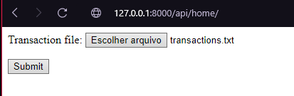
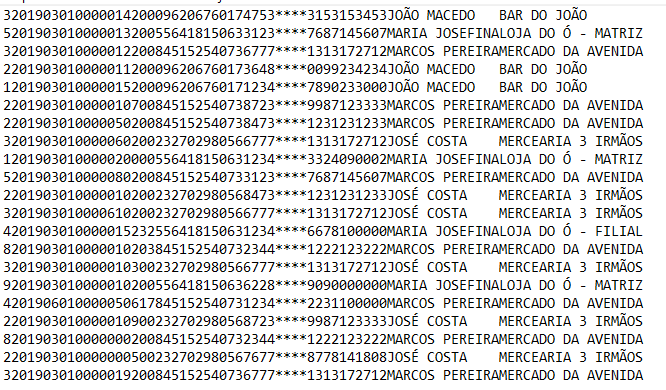
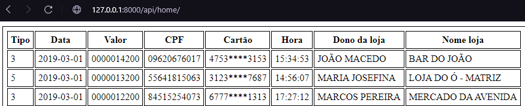

# CNAB

Um projeto que recebe um arquivo CNAB com dados de movimentações financeiras de lojas. </br></br>
A aplicação recebe o arquivo através de um formalário, formata os dados recebidos, armazena no banco de dados e depois renderiza uma tabela mostrando os dados renderizados

## Tabela de conteudos

- [CNAB](#cnab)
  - [Tabela de conteudos](#tabela-de-conteudos)
  - [Tecnologias](#tecnologias)
  - [Introdução](#introdução)
    - [1. Crie seu ambiente virtual](#1-crie-seu-ambiente-virtual)
    - [2. Ative seu venv:](#2-ative-seu-venv)
    - [3. Instale as dependencias](#3-instale-as-dependencias)
    - [4. Executar localmente](#4-executar-localmente)
    - [5. Rotas](#5-rotas)
  - [Como funciona](#como-funciona)
    - [Enviando o arquivo](#enviando-o-arquivo)

## Tecnologias

---

Lista das tecnologias utilizadas no projeto:

- [Django](https://www.djangoproject.com)
- [Technology name](https://www.django-rest-framework.org)
- [PostgreSQL](https://www.postgresql.org)

## Introdução

---

### 1. Crie seu ambiente virtual

```bash
python -m venv venv
```

### 2. Ative seu venv:

```bash
# linux:
source venv/bin/activate

# windows:
.\venv\Scripts\activate
```

### 3. Instale as dependencias

```bash
pip install -r requirements.txt
```

### 4. Executar localmente

- gerar as migrações

```
python manage.py migrate
```

- rodar o servidor local

```
python manage.py runserver
```

### 5. Rotas

- rota local: http://127.0.0.1:8000/api/home/

## Como funciona

---

### Enviando o arquivo

- O arquivo .txt será passado através do formulário abaixo: </br>
  

- Dados CNAB armazenados no arquivo: </br>
  

- Esses dados serão tratados e retornarão uma tabela mostrando como as informações ficaram salvas no banco de dados:
  
